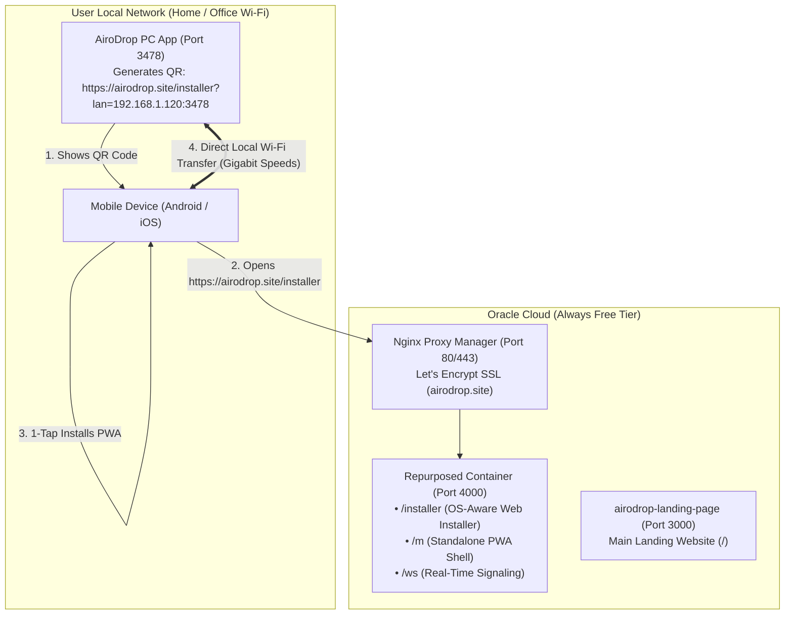
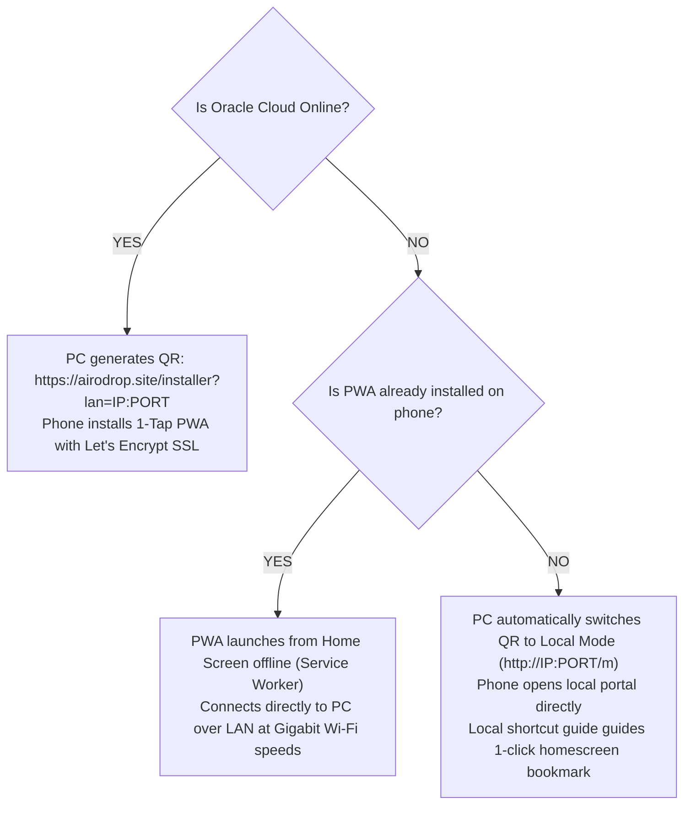

# AiroDrop — PWA Web Installer (`airodrop.site/installer`) & Infrastructure Blueprint

This document specifies the architecture, OS-aware installer logic, container repurposing, and zero-downtime offline fallback for **`https://airodrop.site/installer`**.

---

## 1. 🎯 Executive Architecture: `airodrop.site/installer`

The public gateway **`https://airodrop.site/installer`** is an **OS-Aware Web Installer** that provides 1-tap Progressive Web App (PWA) installation and peer-to-peer pairing for every mobile and desktop operating system with zero friction and zero cost.

---

## 2. 📱 OS-Aware Installer Capabilities (`/installer`)

When a visitor opens `https://airodrop.site/installer` (or scans the QR code from the PC app), the page dynamically detects their OS and adapts:

### A. Android (Google Chrome, Samsung Internet, Brave, Firefox)
- **1-Tap Automatic Install Button**:
  - Captures the browser's `beforeinstallprompt` event.
  - Clicking **"Install AiroDrop (1-Tap)"** triggers the native Android WebAPK installation prompt immediately.
  - Automatically saves the target PC's LAN IP (`?lan=192.168.1.120:3478`) into `localStorage` so the installed app connects to the PC instantly upon launch.
- **Visual Fallback Guide**:
  - Highlights step-by-step visual instructions for Chrome's 3-dot menu (`⋮`) $\to$ **"Add to Home screen"**.

### B. Apple iOS & iPadOS (Safari)
- Detects iPhone / iPad user agents.
- Renders an interactive animated 3-step guide:
  1. Tap the **Share Button** (`⎋`) at the bottom of Safari.
  2. Scroll down and tap **"Add to Home Screen"** (`➕`).
  3. Tap **Add** in the top-right corner.
- Provides a **"Launch Web Portal Now"** button for instant in-browser use.

### C. Desktop (Windows / macOS / Linux)
- Detects desktop environments and presents direct download options for the Windows companion desktop application.

---

## 3. 🔄 Container Repurposing on Oracle Cloud

We repurpose the existing `airodrop-relay` container (running on port 4000 in `nginx_default` network) into the unified **AiroDrop Gateway & Web Installer**:

### Endpoints Hosted by the Container:
1. **`GET /installer`**: Serves the OS-aware responsive PWA Web Installer (`pages/installer.html`).
2. **`GET /m`**: Serves the standalone mobile PWA interface (`mobile.html` + `mobile-app.js`).
3. **`GET /manifest.json`**: Serves the compliant PWA manifest with 192x192 & 512x512 PNG maskable icons.
4. **`GET /sw.js`**: Serves the Service Worker with offline caching strategies.
5. **`WebSocket /ws`**: Handles lightweight peer-to-peer signaling between PC and mobile.

### Nginx Proxy Manager (NPM) Route Mapping on `airodrop.site`:
| Path | Target Container | Purpose |
| :--- | :--- | :--- |
| **`/installer`** | `http://airodrop-relay:4000/installer` | OS-Aware Web Installer |
| **`/m`** | `http://airodrop-relay:4000/m` | Mobile PWA Shell |
| **`/manifest.json`** | `http://airodrop-relay:4000/manifest.json` | PWA Manifest |
| **`/sw.js`** | `http://airodrop-relay:4000/sw.js` | Service Worker |
| **`/ws`** | `http://airodrop-relay:4000/ws` | Signaling WebSocket |
| **`/`** | `http://airodrop-nextjs:3000/` | Main Landing Website |

---

## 4. 🛡️ Offline & Cloud-Down Resilience (Zero-Failure Fallback)

What happens if Oracle Cloud goes down, internet drops, or the user is in an isolated Wi-Fi environment?

1. **Installed PWA Offline Launch**:
   - The Service Worker pre-caches all HTML, JS, CSS, and SVG icons on the first visit.
   - When the user taps the AiroDrop icon on their home screen, the app opens instantly **even in Airplane Mode**.
   - The app reads the cached LAN host or scans the local network, communicating directly with the PC over Wi-Fi without needing internet access.

2. **First-Time Offline User (Local Web Portal Fallback)**:
   - The PC desktop app automatically pings the gateway. If unreachable, the PC dashboard automatically switches the QR code to:
     `http://192.168.1.120:3478/m`
   - All core capabilities (file sending/receiving, media streaming, clipboard vault, trackpad) operate 100% locally.

---

## 5. 🔒 Verification & Safety Standards

- **Strict Media Preview Scoping**: Images, Videos, and Audio preview natively; all other files show the "Cannot preview this file type. Download instead" card.
- **Non-Dismissable Native Video Playback**: Fullscreen native video player with touch event propagation protection and zero audio leakage.
- **Frictionless Streamed Downloads**: All file downloads throughout the interface use direct streamed downloads with real-time progress bars.
- **Immutable Git Push Policy**: Changes are committed locally; no `git push` is ever executed without explicit user confirmation.
