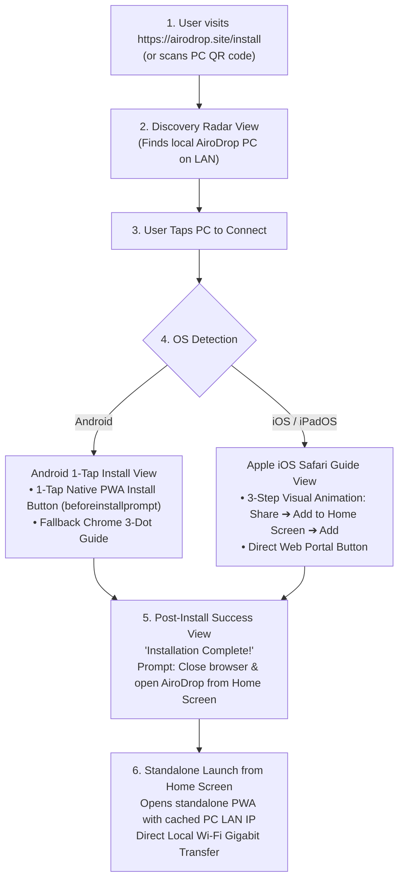

# Implementation Plan — AiroDrop OS-Aware PWA Web Installer (`https://airodrop.site/install`)

This document specifies the complete architectural design and implementation plan for the **AiroDrop PWA Web Installer** hosted at **`https://airodrop.site/install`**.

---

## 1. User Journey & Core Interaction Flow

---

## 2. Key Modules to Implement

### Module A: Radar Device Discovery (`pages/installer.html`)
- **Discovery Engine**:
  - Checks URL query parameters (`?lan=192.168.1.X:3478&name=MyPC&pin=1405`) when opened via PC QR code.
  - If opened directly (`https://airodrop.site/install`), triggers a local network probe / WebRTC discovery or WebSocket room pairing over `wss://airodrop.site/ws`.
  - Renders a clean, dynamic radar interface (AirDrop / Snapdrop style) displaying detected PC devices with name, IP, and live status.
  - Manual IP entry fallback for custom subnet environments.

### Module B: OS-Aware PWA Installation Screen
- **Device Selection Action**:
  - Tapping a detected device caches its target LAN address and authorization PIN in `localStorage` (`airodrop_paired_host`, `airodrop_auth_pin`).
  - Smoothly transitions the interface to the OS-specific installation view.
- **Android Flow**:
  - Captures `beforeinstallprompt` event.
  - Displays prominent **"Install AiroDrop (1-Tap)"** button with high-contrast styling.
  - Includes an expandable visual guide for Chrome's 3-dot menu (`⋮` $\to$ **Add to Home screen**).
- **iOS Safari Flow**:
  - Automatically identifies iPhone and iPad Safari browsers.
  - Displays a 3-step visual instruction card:
    1. Tap **Share** (`⎋`) on Safari bottom navigation.
    2. Tap **Add to Home Screen** (`➕`).
    3. Tap **Add** in top right.
  - Displays secondary **"Launch Web Portal Now"** action.

### Module C: Post-Installation Completion Guidance
- **App Installed Event Handling**:
  - Listens to `appinstalled` event on Android.
  - When installed or confirmed, displays the completion screen:
    - **Header**: *"AiroDrop App Installed!"*
    - **Instructions**: *"Please close this browser tab and launch AiroDrop from your Home Screen. It will automatically connect to your PC."*
    - Button: *"Launch Web Portal Now"* (for instant fallback).

### Module D: Standalone PWA Shell (`pages/mobile.html`, `public/mobile-app.js`, `public/sw.js`)
- **Offline Caching & Standalone Launch**:
  - Service worker caches all static assets (`mobile.html`, `mobile-app.js`, icons, CSS).
  - Standalone PWA checks `localStorage.getItem('airodrop_paired_host')` on launch and immediately connects to the target PC over LAN without cloud dependency.

---

## 3. Server-Side Integration (`relay-server` on Oracle Cloud)

- **Target Container**: `airodrop-relay` (Port 4000)
- **Nginx Proxy Manager Route Mapping**:
  - `https://airodrop.site/install` $\to$ `http://airodrop-relay:4000/install`
  - `https://airodrop.site/installer` $\to$ `http://airodrop-relay:4000/installer`
  - `https://airodrop.site/m` $\to$ `http://airodrop-relay:4000/m`
  - `https://airodrop.site/manifest.json` $\to$ `http://airodrop-relay:4000/manifest.json`
  - `https://airodrop.site/sw.js` $\to$ `http://airodrop-relay:4000/sw.js`
  - `https://airodrop.site/ws` $\to$ `http://airodrop-relay:4000/ws`

---

## 4. Verification & Testing Plan

1. **Discovery Verification**:
   - Test `https://airodrop.site/install?lan=192.168.1.22:3478&name=AsepPC` $\to$ Instantly discovers and displays `AsepPC`.
   - Test visiting `https://airodrop.site/install` directly without query params $\to$ Shows radar discovery and manual IP option.
2. **Android PWA Install Flow**:
   - Verify `beforeinstallprompt` triggers native WebAPK installation prompt.
   - Verify `appinstalled` triggers the completion screen.
3. **iOS Safari Guide Flow**:
   - Verify user-agent detection displays the 3-step visual Share Sheet guide on iOS devices.
4. **Standalone Launch & LAN Connection**:
   - Verify launching the installed PWA from home screen reads the cached PC host and establishes direct Wi-Fi communication with the desktop app.
