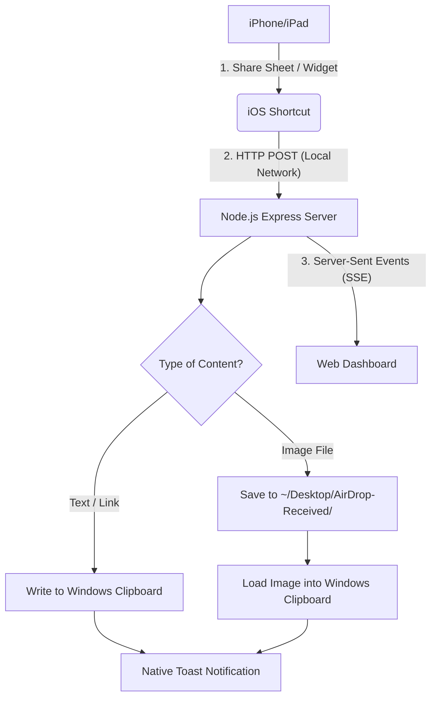

# 🚀 AiroDrop — AirDrop to PC (iOS ⇄ Windows Integration)

[](https://nodejs.org/)
[](https://microsoft.com/windows)
[](https://support.apple.com/guide/shortcuts/welcome/ios)
[](https://opensource.org/licenses/MIT)

**AiroDrop** is a lightweight, self-hosted integration tool that replicates Apple's "Universal Clipboard" and "AirDrop" experience between an **iPhone/iPad** and a **Windows PC** over the local network. 

Using **native iOS Shortcuts**, you can send text, links, and high-quality images straight from your phone's Share Sheet directly into your Windows clipboard (for immediate pasting with `Ctrl+V`), and save images directly to a folder on your PC desktop—all in real-time, accompanied by native desktop toast notifications.

---

## 📽️ System Workflow



---

## ✨ Key Features

*   **⚡ Near-Zero Latency Clipboard Sync**: Copy text on your iPhone and instantly paste it on your PC (or vice-versa) in under a second.
*   **📸 Direct Image Sharing**: Send photos and screenshots directly from your iOS Photos app to your PC. Images are saved to your PC's desktop at `~/Desktop/AirDrop-Received/`.
*   **📋 Native Windows Image Paste**: Transferred images are injected directly into the Windows clipboard using background PowerShell script execution. You can paste them immediately into apps like Discord, Figma, Photoshop, or Word using `Ctrl+V`.
*   **🛠️ Zero-Config Shortcut Compiler**: The server automatically detects your PC's local IP address and compiles custom `.shortcut` files. You don't have to manually edit the URL or IP inside the iOS Shortcuts app—simply scan a QR code and tap to import!
*   **🔔 Native Toast Notifications**: Receive instant, beautiful Windows desktop notifications when text or files are received, including character snippets for text and filename details for images.
*   **💻 Responsive Web Dashboard**: Monitor active connections, browse transfer history, and queue content (text/images) to be picked up by your iOS devices using the built-in, real-time web portal (powered by Server-Sent Events).
*   **🔌 Silent Autostart**: Easy-to-install background task (`install-autostart.bat`) launches the server invisibly on Windows boot (no annoying terminal windows left open).

---

## 💡 Practical Use Cases

*   **The Developer Workflow**: Instantly copy 2FA authentication codes, API keys, terminal snippets, or StackOverflow links from your phone and paste them directly into VS Code.
*   **The Content Creator Workflow**: Take a screenshot or photo on your phone, tap share -> *"Send to PC"*, and immediately press `Ctrl+V` to paste the raw image directly into your design software (Figma/Photoshop) or chat client (Discord/Slack).
*   **Bi-directional Text Drops**: Type a long note, draft an email, or pull up a complex URL on your PC, queue it in the dashboard, and import it into your iOS device clipboard in seconds.

---

## 🛠️ Getting Started

### Prerequisites
*   Both your PC and iPhone/iPad must be connected to the **same Wi-Fi network**.
*   **Node.js v18.0.0** or higher installed on your PC.

---

### Step 1: PC Server Setup

1.  **Clone or download** this repository to your PC:
    ```bash
    git clone https://github.com/your-username/AiroDrop.git
    cd AiroDrop
    ```
2.  **Install dependencies**:
    ```bash
    npm install
    ```
3.  **Start the server**:
    ```bash
    npm start
    ```
    *You will see terminal output indicating the server is running, your local network IP (e.g., `192.168.1.42:3478`), and a QR code.*

---

### Step 2: iPhone / iPad Shortcut Setup

No manual coding or editing in the Shortcuts app is necessary:

1.  Keep the server terminal open on your PC, or open your PC web browser and navigate to `http://localhost:3478`.
2.  Open your iPhone's camera app and **scan the QR code** printed in the terminal or displayed on the Web Dashboard.
3.  Your iPhone will load the mobile setup dashboard (`http://<PC-IP>:3478/m`).
4.  Tap the installation buttons to download and add the pre-configured shortcuts to your iOS Shortcuts App:
    *   📥 **Send to PC** (Enables sharing images, links, or text from the Share Sheet of *any* app)
    *   📋 **Send Clipboard** (Home Screen Widget button that instantly uploads whatever text is in your iOS Clipboard)
    *   🔄 **Check PC** (Enables bi-directional clipboard sync by checking for pending items from the PC)

> [!NOTE]
> For a detailed, step-by-step walkthrough of creating or customizing these iOS Shortcuts manually, consult the [Shortcut Setup Guide](file:///c:/Users/aseps/Downloads/AiroDrop/setup-shortcut.md).

---

### Step 3: Run silently on Windows Startup (Optional)

If you want the AiroDrop server to run seamlessly in the background without needing to keep a command prompt open:

1.  Run the **`install-autostart.bat`** script once (preferably as Administrator).
    *   This creates a silent VBScript wrapper (`start-hidden.vbs`) and schedules a Windows Task to launch the server quietly on user login.
2.  The server output will log to `server.log` inside the project directory.
3.  To remove this at any time, run **`uninstall-autostart.bat`**.

---

## 📱 How to Use

| Operation | Action | Result |
| :--- | :--- | :--- |
| **Send Image to PC** | Select an image in Photos ➜ tap **Share** ➜ select **"Send to PC"**. | The image is saved to `~/Desktop/AirDrop-Received/`, copied to your PC clipboard, and you receive a toast notification. |
| **Send Link / Selected Text** | Highlight text or open a webpage ➜ tap **Share** ➜ select **"Send to PC"**. | The text is copied to your PC clipboard and shown as a toast notification. Just press `Ctrl+V` to paste. |
| **Send iOS Clipboard** | Tap the **"Send Clipboard"** shortcut widget on your iOS Home Screen. | Uploads your current iOS clipboard directly to your PC clipboard. |
| **Pull from PC to iOS** | Click **"Send to Phone"** on the PC dashboard ➜ tap the **"Check PC"** shortcut on iOS. | The queued text is copied to your iOS clipboard, and queued images are saved to your Photos. |

---

## 🔌 API Reference (For Developers)

You can easily integrate your own scripts, task runners, or automation tools with AiroDrop. The server exposes the following JSON endpoints:

### `POST /api/text`
Copies the provided text payload directly to the Windows clipboard.
*   **Body (`application/json`)**:
    ```json
    { "text": "Hello PC!" }
    ```
*   **Response (`200 OK`)**:
    ```json
    { "success": true, "message": "Text received and copied to clipboard" }
    ```

### `POST /api/image`
Uploads and saves a multipart file, copying it directly to the system clipboard (Windows only).
*   **Body (`multipart/form-data`)**: Form field `image` containing the binary file.
*   **Response (`200 OK`)**:
    ```json
    { "success": true, "filename": "2026-07-02_12-00-00_photo.png", "message": "Image saved successfully" }
    ```

### `POST /api/send-to-phone`
Queues items on the server for the iOS device to fetch.
*   **Body (`application/json`)**:
    ```json
    { "type": "text", "text": "Sent from PC" }
    // Or for images:
    { "type": "image", "imageUrl": "http://192.168.1.42:3478/received/image.png" }
    ```

### `GET /api/pending`
Polls for queued messages waiting to be synced to the iPhone. Used by the "Check PC" iOS Shortcut.
*   **Response (`200 OK`)**:
    ```json
    { "items": [{ "id": "l8j3g9s", "type": "text", "content": "Sent from PC", "timestamp": "2026-07-02T12:00:00.000Z" }] }
    ```

### `GET /api/history`
Returns a history log of the last 100 received items.

---

## 🔍 Troubleshooting & Network Configuration

### 1. Connection Times Out on iOS
*   **Check Wi-Fi Network**: Ensure both your PC and iPhone/iPad are connected to the exact same SSID network. If your PC is on Ethernet, make sure it is connected to the same router subnet/local network as your Wi-Fi.
*   **Windows Firewall**: The server runs on port `3478` by default. You may need to authorize Node.js to accept incoming connections in the Windows Defender Firewall settings:
    1.  Open **Windows Security** ➜ **Firewall & network protection**.
    2.  Click **Allow an app through firewall**.
    3.  Locate `Node.js JavaScript Runtime` and ensure both **Private** and **Public** checkboxes are ticked.
*   **AP Isolation (Access Point Isolation)**: Some routers (especially guest networks or university Wi-Fi) prevent local devices from communicating directly with each other. Disable "AP Isolation" or "Client Isolation" in your router settings.

### 2. Images Fail to Save
*   By default, the server creates and writes to `~/Desktop/AirDrop-Received`. If Windows permission settings block this path, the server will gracefully fallback to writing inside the `received/` subdirectory inside the project installation folder.

---

## 📂 Project Structure

```text
├── public/                 # Web Dashboard Assets
│   ├── app.js              # Real-time WebSocket/SSE Frontend Logic
│   ├── index.html          # PC Dashboard
│   ├── mobile.html         # Mobile Setup Portal
│   ├── style.css           # Premium Glassmorphic CSS Styling
│   └── sw.js               # Service Worker
├── clipboard.js            # Cross-platform Clipboard Integration
├── notify.js               # Windows Native Toast Notifications
├── generate-shortcuts.js   # Dynamic iOS Shortcut Compiler (.shortcut files)
├── server.js               # Node.js Server & REST API Engine
├── install-autostart.bat   # Windows Startup Setup Script
├── uninstall-autostart.bat # Windows Startup Removal Script
└── package.json            # Dependencies & Scripts
```

---

## 📄 License

This project is open-source software licensed under the [MIT License](LICENSE).
