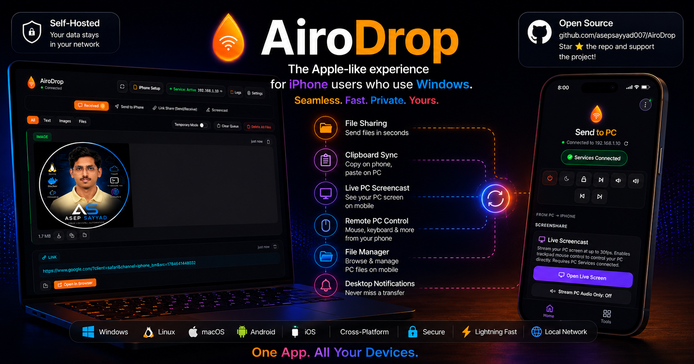

# AiroDrop v6.2.13 🚀



A beautiful, self-hosted local network alternative to Apple's AirDrop and Universal Clipboard. AiroDrop allows you to seamlessly transfer text, links, images, and files between iOS/Android devices and your Windows PC over Wi-Fi — plus remote control your PC and stream your screen directly to your mobile webapp.

---

Official Website **[AiroDrop](https://airodrop.site/)** |  Creator Portfolio **[Creator Portfolio](https://asepsayyad007.in/)**


---

## ⚡ Highlighted Feature: Instant Clipboard Sync

> [!IMPORTANT]
> **Text or images sent from your iPhone Shortcut are automatically synced with your PC clipboard. Just share/send on your iPhone and instantly paste (Ctrl+V) wherever you want on your PC!**

---

## 🚀 What's New in v6.2.13

Stabilizes the auto-update system for reliable production use.

### 🔄 Auto-Updater Stability
- **Fixed race condition** — Startup update check now delayed 10s to ensure server config is fully loaded before querying GitHub.
- **30-second timeout** — Update checks no longer hang indefinitely on poor connections; times out with a user-friendly message.
- **Download error recovery** — Failed downloads now show a dialog and reset UI state cleanly instead of leaving the app in a broken "downloading" state.
- **Window crash protection** — All IPC sends now check `mainWindow.isDestroyed()` to prevent Electron crashes when the window is closed during an update.
- **Auto-install on quit** — If user clicks "Later" on a downloaded update, it installs automatically on next app quit.
- **Proper semver comparison** — Both the Electron updater and `/api/check-update` endpoint now compare versions numerically (major.minor.patch) instead of naive string equality. Local builds ahead of remote no longer falsely flag as "update available".

### 🛠 CI/CD Fix
- **Release workflow** — No longer triggers on every push to `main`. Now only builds and publishes when a `v*` tag is pushed, or via manual workflow dispatch. This prevents duplicate/phantom releases that confused electron-updater.

### 🌐 API Improvements
- **`/api/check-update`** — 15s request timeout, GitHub rate-limit handling (429), proper error messages, `publishedAt` field in response.

---

## 🚀 What's New in v6.2.12

Cleanup and accuracy release — removes internal development artifacts and corrects legal documentation.

### 🧹 Housekeeping
- **Removed internal planning files** — `.kiro/plans/` and `Build Instructions Guide.md` no longer tracked in repository.
- **Updated `.gitignore`** — `.kiro/` directory now excluded from version control.

### 📜 Legal & Privacy Accuracy
- **Fixed auth token storage claim** — LEGAL.md and PRIVACY.md now correctly state that paired device tokens are stored both in browser localStorage *and* on the PC (`paired_devices.json`). Previously claimed browser-only storage.
- **Clarified IP address logging** — No persistent logs are retained, but transient console output exists during runtime.

---

## 🚀 What's New in v6.2.0

This is a major production-hardening release focused on security, reliability, and developer experience:

### 🛡️ Security Hardening
- **HTTP Security Headers** — Helmet.js integration with CSP, X-Frame-Options, X-Content-Type-Options, Referrer-Policy, and DNS prefetch control.
- **Input Sanitization** — New `src/sanitize.js` module: filename sanitization, path traversal prevention, settings validation (port, PIN, device name, security mode).
- **Hardened CORS** — Wildcard `*` replaced with local-network-only origin validation (RFC 1918 private IP ranges).
- **PIN Brute-Force Protection** — 5-attempt soft lockout (5 min), 10-attempt hard lockout (30 min), `Retry-After` header, automatic expiry cleanup.
- **CSRF Protection** — Origin/Referer validation for state-changing endpoints, with exemptions for iOS Shortcuts and localhost.
- **Secure Cookies** — `SameSite=Lax`, `Secure` flag when HTTPS enabled, `Path=/`, 7-day expiry.
- **HTTP Parameter Pollution (HPP)** protection.

### 📋 Structured Logging & Error Handling
- **Winston Logger** — Leveled logging (error/warn/info/http/debug), daily-rotated log files (7-day retention), JSON format for machine parsing, colorized console output.
- **Centralized Error Handler** — Consistent error response format, Multer/parse error classification, `AppError` class with factory methods.
- **Request ID Tracking** — Unique 16-char hex ID on every request (`X-Request-ID` response header), correlated in logs.
- **Async Route Wrapper** — Eliminates try/catch boilerplate across all route handlers.
- **Process Crash Handlers** — Uncaught exception/rejection logging with graceful state persistence.

### 🏗️ Server Robustness
- **Graceful Shutdown** — Closes WebSocket/SSE connections with notification, saves history + scratchpad, 5s drain timeout.
- **Health Check Endpoint** — `GET /api/health` returns version, uptime, memory usage, connection counts, disk writability.
- **Request Timeouts** — 30s for API routes, 10min for uploads/downloads, 408 on timeout.
- **Sliding Window Rate Limiter** — Per-IP per-category (default: 60/min, auth: 10, upload: 20, control: 30), `Retry-After` header.
- **Port Conflict Resolution** — Automatic retry on `EADDRINUSE` (up to 3 attempts, +2 per retry).

### ✨ Frontend Polish
- **Global Fetch Retry** — 2 retries with exponential backoff, automatic error toasts, auth/rate-limit awareness.
- **Loading Skeleton States** — Shimmer animation on initial history load.
- **SSE Reconnection** — Exponential backoff (1s → 30s cap), countdown in status indicator, resets on success.
- **Keyboard Accessibility** — `:focus-visible` outlines, Escape to close modals, focus management, `aria-modal` attributes.
- **Service Worker Versioning** — Cache name tied to app version, stale caches auto-purged, update toast prompt with tap-to-refresh.

---

## 🚀 What's New in v6.1.14

This release brings version 6.1.14, resolving critical live desktop screencast connection, audio streaming, and keyboard input bugs:

### ✅ New Features & Updates
1. 🖥️ **WebRTC Connection & mDNS Resolution Fix** — Implemented STUN servers to resolve local network WebRTC connectivity issues caused by masked mobile mDNS `.local` hostnames. Added incoming ICE candidate queuing on mobile/PC to prevent race condition crashes before SDP descriptions resolve.
2. ⌨️ **Screencast & Trackpad Keyboard Input Fix** — Fixed WS key events so typing on the virtual keyboard inside Screencast and Trackpad overlays now translates to keystrokes on the host PC. Expanded Win32 FFI key mapping to fully support punctuation and shift-key symbols.
3. 🔊 **PC System Audio Streaming Support** — Configured system audio loopback capture in Electron's `setDisplayMediaRequestHandler` to stream remote PC sound to mobile screenshare sessions in real-time.
4. ⚡ **Resource Leak & Disconnect Fix** — Added stream/connection cleanup on reconnects and cleared the 30-second disconnect timeout when a device successfully connects.

---

## 🚀 What's New in v6.1.13

This release brings version 6.1.13, resolving mouse cursor interactions during live desktop screencast:

### ✅ New Features & Updates
1. 🖥️ **Live Screencast Cursor Control Fix** — Implemented cases for `move_abs` and `click_abs` absolute pointer event messages inside the host WebSocket handler (`src/trackpad.js`). Tapping or dragging on the live mobile view now correctly positions and triggers left/right clicks on the remote Windows desktop.

---

## 🚀 What's New in v6.1.12

This release brings version 6.1.12, establishing migration to our official domain:

### ✅ New Features & Updates
1. 🌐 **Official Domain Migration** — Migrated the production cloud relay tunnel and all endpoint integrations from `airodrop.bootstrapx007.online` to the dedicated project domain **`airodrop.site`**.
2. ⚡ **WebSocket Proxy Tuning** — Optimised proxy location routing parameters on the Nginx proxy servers for improved tunnel connectivity.

---

## 🚀 What's New in v6.1.11

This release brings version 6.1.11, adding multi-file selection support and single zip archive link generation:

### ✅ New Features & Updates
1. **📦 Multi-File Share Link Selection** — Drop or select multiple files simultaneously in the desktop Share-to-Friend dashboard with individual file removal and aggregate byte calculation.
2. **🗜️ On-the-Fly Zip Bundling** — Automatically compresses multiple selected files into a single `.zip` archive on-the-fly (`airodrop-archive-YYYY-MM-DD.zip`), generating one unified share link for recipient downloads.

---

## 🚀 What's New in v6.1.10

This release brings version 6.1.10, updating iOS Shortcuts, pairing setup flow, and pairing request behavior:

### ✅ New Features & Updates
1. **📲 Updated iOS Shortcuts** — Updated all pre-made iOS Shortcut iCloud links and QR codes across PC Setup, Mobile WebApp, and documentation.
2. **🔄 Setup Tab Workflow** — Reordered Setup Modal tabs to highlight iOS Shortcuts installation as Step 1 ("Step 1: Install iOS Shortcuts").
3. **🤝 Automatic Pairing Auto-Approval** — When Security Mode is set to **Open Network (Auto-Approve)**, pairing requests from new devices are automatically approved with zero manual confirmation needed.

---

## 🚀 What's New in v6.1.9

This release brings version 6.1.9, adding auto-save settings synchronization for security and shortcut configurations:

### ✅ New Features & Updates
1. **🔒 Auto-save Security Settings** — Added immediate change listeners to `securityModeInput` and `shortcutSecretInput` within the iPhone Setup Modal. Edits to the Shortcut Secret or security mode are now instantly committed to the backend server automatically upon change or focus loss.

---

## 🚀 What's New in v6.1.8

This release brings version 6.1.8, introducing cache-busting, service worker bypass rules, and HTTP header adjustments to resolve client-side cache lockups:

### ✅ New Features & Updates
1. **🧹 Force Client PWA Cache-Busting** — Added cache-busting URL parameter query strings (`mobile-app.js?v=6.1.8`) to the script tag in [public/mobile.html](file:///C:/Users/aseps/Downloads/AiroDrop/public/mobile.html) to invalidate and bypass cached javascript client scripts.
2. **🔄 Service Worker Bypass Rules** — Configured [public/sw.js](file:///C:/Users/aseps/Downloads/AiroDrop/public/sw.js) to bypass cache matching for core mobile application requests (`/mobile-app.js`, `/mobile.html`, `/m`), forcing the mobile browser to fetch these directly from the local server.
3. **⚡ Static HTTP Header Adjustments** — Configured [server.js](file:///C:/Users/aseps/Downloads/AiroDrop/server.js) to serve `sw.js` and `mobile-app.js` with `no-store` and `max-age=0` directives, preventing standard browser HTTP cache storage.

---

## 🚀 What's New in v6.1.7

This release brings version 6.1.7, introducing WebSocket setup optimization, upgrade error-handling guards, cookie-quote stripping, and service worker cache invalidation:

### ✅ New Features & Updates
1. **🔒 WebSocket Server Instance De-duplication** — Prevented double instantiation of `state.wss` and duplicate listener registrations of the trackpad `'connection'` events when binding to fallback port upgrades.
2. **🛡️ Upgrade Path Normalization & Rejection Guards** — Handled errors inside the upgrade handler to cleanly reject sockets instead of leaving them hanging, and added trailing slash support (e.g. `/trackpad/`).
3. **🔄 Cookie Quote-Stripping & Try-Catch constructor** — Stripped single/double quote delimiters when fetching the session token from client cookies, and wrapped client-side `new WebSocket()` creation inside `try...catch` blocks to prevent page execution hangs.
4. **🧹 PWA Cache Version Invalidation** — Bumped the PWA service worker cache name to `airodrop-cache-v6` to guarantee browsers instantly load the updated mobile client assets.

---

## 🚀 What's New in v6.1.6

This release brings version 6.1.6, introducing session revocation synchronization, tab layout refinement, and select element contrast visibility fixes:

### ✅ New Features & Updates
1. **📱 Unified Quick Connect & Security Tab** — Renamed the Device Security tab to **Quick Connect & Device Security** and integrated the Quick Connect QR code directly within it.
2. **👁️ Dropdown Option Text Visibility** — Explicitly styled option tags within the Security Mode dropdown to guarantee high-contrast readability, resolving the transparent/invisible text bug in Chromium/Electron dark overlays.
3. **🔒 Instant Active Session Revocation** — Configured unpairing actions on the PC dashboard to immediately broadcast a `revoked` WebSocket command, terminating remote clients' active WebRTC screencasts and forcing an immediate logout to the PIN entry screen.
4. **🛡️ Secure WebSocket Upgrade Guards** — Secured the WebSocket server upgrades to reject connection attempts from unauthorized/unpaired devices when security is active.

---

## 🚀 What's New in v6.1.5

This release brings version 6.1.5, introducing full Device Security, Access Control, and pairing validation directly from the PC Dashboard:

### ✅ New Features & Updates
1. **🛡️ Device Security & Access Control** — Complete security framework supporting customizable modes: *Protected* (requires a PIN or host screen approval), *Secret Token* (iOS Shortcut header matching), and *Open* (unauthenticated).
2. **📱 iPhone Setup Modal Integration** — Moved the security configurations (PIN generation, shortcut token definition) directly into the onboarding modal, making it the default top setup tab.
3. **👥 Dynamic Paired Devices List** — Renders all currently paired mobile devices with their names, IP addresses, and pairing dates, alongside instant individual **Revoke** action buttons.
4. **⚡ Real-Time SSE Updates** — Integrates device state changes with the dashboard's Server-Sent Events stream, ensuring the active devices list updates instantly as remote devices pair or get revoked.
5. **🔄 Localhost Auth Bypass** — Restores seamless local administration by exempting loopback connections (`localhost` / `127.0.0.1`) from remote authentication blocks.

---

## 🚀 What's New in v6.1.4

This release brings version 6.1.4, fixing a critical stream failure and client UI freeze during parallel upload exceptions:

### ✅ New Features & Updates
1. **🛡️ Robust Upload Exception Handling** — Resolved a key mapping mismatch in `relay-server/server.js`'s `handleUploadError` where failed streams were cleared by `token` instead of `fileId`. This ensures interrupted transfers are properly pruned from memory, avoiding persistent `429` (Upload already in progress) errors.
2. **🔄 Sync File Failure Propagation** — Enhanced the WebSocket error payload to propagate `fileId` to the PC client on upload failures. This prevents the client UI from freezing in a perpetual `'receiving'` state when a stream errors out or is aborted.

---

## 🚀 What's New in v6.1.3

This release brings version 6.1.3, focusing on bulk transaction stability, mobile custom keyboard viewport positioning, notification aggregation, and updater user controls:

### ✅ New Features & Updates
1. **📦 Multi-File Bulk Transaction Reliability** — Fixed a bug where "Download All" would fail for subsequent files in a 1-time upload queue due to premature token deletion.
2. **🔔 Aggregated Completed Notifications** — Added system notification debouncing. Downloading multiple files at once now shows a single consolidated desktop notification rather than spamming multiple alert cards.
3. **⌨️ Adaptive Portrait Custom Keyboard** — Automatically collapses the custom virtual key grid and bottom padding when the native virtual keyboard gains focus on mobile in portrait mode. This maximizes screencast video viewport space.
4. **🔍 Prevention of Mobile Input Focus Zooming** — Standardized mobile keyboard input elements to `16px` font-size to prevent iOS Safari auto-zooming and layout shifting.
5. **⚙️ Interactive User Auto-Updater Dialogue** — The auto-updater now prompts the user with a detailed three-option dialogue box ("Download Now", "Skip This Update", "Later") complete with formatted markdown release notes fetched directly from GitHub. Skipping an update persists to local settings.

---

## 🚀 What's New in v6.1.2

This release brings version 6.1.2, introducing major feature upgrades to Live Screencast UX, P2P Link Sharing, and a comprehensive project-wide security hardening:

### ✅ New Features & Updates
1. **🔍 Pinch-to-Zoom & Panning** — High-performance 2-finger pinch-to-zoom (up to 5×) and drag-to-pan on the Live PC Screencast. A floating "Reset Zoom" button appears whenever zoom is active.
2. **📐 Landscape Orientation Layout Fix** — Completely resolves the broken layout when rotating your phone sideways during screencast. The bottom navigation tabs and main UI are now properly hidden behind the full-screen overlay, with no bleed-through.
3. **⌨️ Smart Landscape Keyboard** — In landscape mode, the custom virtual keyboard rows auto-hide so the screencast video stays fully visible above the typing input. Only the text-entry bar is shown, keeping the screen clean.
4. **📱 Visual Viewport Keyboard Fitting** — The screencast overlay now tracks the browser's Visual Viewport API (scroll + resize) and additionally listens to `orientationchange` and `resize` events, so the screen always fits perfectly regardless of rotation or keyboard state.
5. **🔗 Advanced P2P Link Share** — Directly stream multiple files concurrently over the internet using a zero-storage tunnel! Supports batched downloads and real-time interactive host acceptance.
6. **🛡️ Comprehensive Security Hardening** — Full elimination of Path Traversal, PowerShell shell injection (now uses native FFI), Stored XSS mitigations, strict loopback API guarding, and Electron IPC whitelisting.
7. **🐛 Service Worker Stability Fix** — Removed an infinite page-reload loop caused by a faulty SW `updatefound` handler. The PWA now loads reliably every time.

---

## 📥 Downloads (v6.1.10)

Get the latest pre-compiled binaries for Windows:
* **[Download Setup Installer (v6.1.10)](https://github.com/asepsayyad007/AiroDrop/releases/download/v6.1.10/AiroDrop.Setup.6.1.10.exe)** — Standard Windows wizard installation.
* **[Download Portable Version (v6.1.10)](https://github.com/asepsayyad007/AiroDrop/releases/download/v6.1.10/AiroDrop-Portable-6.1.10.exe)** — Standalone execution without installation.

---

## How It Works

* **Instant Clipboard Sync:** Copying text or sharing images on your phone pushes them to your PC's clipboard (Ctrl+V) instantly. Shared links from Safari/Chrome have clean URLs extracted automatically.
* **Bi-directional Queue:** Push links or text snippets from your PC dashboard to the mobile portal inbox, or download files directly onto your phone.
* **File Browser:** Open `http://<PC-IP>:<PORT>/files` in Safari to browse, upload, download, and manage files on your PC's shared folder.
* **Live Screencast:** Tap "Open Live Screen" on the mobile portal to stream your PC desktop at ~15fps with optional interactive mouse control.

---

## Core Features

* **⚡ Auto Clipboard Sync (iPhone → PC):** Text or images sent from your iPhone Shortcut are automatically synced with your PC clipboard. Just send on iPhone and paste (Ctrl+V) where you want.
* **📁 HTTP File Browser:** Premium mobile-first file manager served at `/files`. Browse, upload (up to 4 GB), download, rename, delete, create folders. Works in any browser — no app required.
* **📁 Files App SMB Integration:** Expose your shared folders using native Windows SMB. Connect directly via the iOS Files app &rarr; Connect to Server &rarr; `smb://[YOUR-PC-IP]` for full file browser access natively.
* **🖱️ Remote Trackpad & Keyboard:** Full touchpad gesture support: move cursor, left/right click, double-click, 2-finger scroll, and real-time keyboard typing sync.
* **🖥️ Live PC Screencast:** Stream your PC desktop to your phone at ~15fps. Interactive mode lets you tap and drag directly on the stream to control your PC.
* **🔌 Universal Connection:** Unified connection state management. Connect on portal load, with auto-reconnect fallback and status indicators.
* **🛠️ PC Remote Control Utilities:** Lock your PC, trigger Sleep mode, or perform a clean Power Off directly from your phone.
* **📊 Statistics & Storage Metrics:** Monitor total uploads, file counts, server uptime, and storage limits.
* **🔒 Security PIN Lock:** Optional Access PIN lock screen to protect your sharing dashboard on shared local networks.
* **🔔 Desktop Notifications:** Native bubble/banner notifications alert you when text, links, or images are received.
* **📱 Native-grade PWA (Progressive Web App):** Add to Home Screen on iOS and Android. Offline fallback and service worker caching.
* **🎨 5 Distinct Themes:** Sunset (default), Dark, AMOLED, Nord, and Dracula.

---

## Prerequisites

* Both your PC and mobile device must be connected to the same local network subnet (Wi-Fi).
* **Node.js v18.0.0** or higher installed on your PC.

---

## Installation & Setup (Developer Mode)

To run or modify the app locally:

1. **Clone this repository:**
   ```bash
   git clone https://github.com/asepsayyad007/AiroDrop.git
   cd AiroDrop
   ```
2. **Install dependencies:**
   ```bash
   npm install
   ```
3. **Run in Development Mode:**
   ```bash
   npm start
   ```

*To package the application into standalone installers (`.exe` or portable), see the [Build Instructions Guide.md](Build%20Instructions%20Guide.md).*

---

## 📁 Using the File Browser & Files App (SMB)

### Option 1: Native iOS Files App (SMB)
1. Right-click your shared folder on Windows &rarr; **Properties** &rarr; **Sharing** &rarr; Click **Share** and add your user account with Read/Write permission.
2. Open the native **Files app** on your iPhone.
3. Tap the **•••** icon at the top right &rarr; select **Connect to Server**.
4. Enter the SMB path: `smb://<YOUR-PC-IP>` (obtained from the dashboard).
5. Choose **Registered User**, enter your Windows username and password, and tap **Connect**.

### Option 2: Web File Browser
1. Open the AiroDrop PC dashboard &rarr; click **"Setup / Connect"** &rarr; go to the **"Files App / Browser"** tab to see your URL.
2. On your iPhone/Android, open **Safari or Chrome** and navigate to: `http://<YOUR-PC-IP>:<PORT>/files`
3. Browse your PC's shared folder, tap any file to **download** it to your phone, or tap **＋** to **upload** files.
4. Long-press any file/folder for rename and delete options.

---

## 🖥️ Using Live Screencast

1. On your phone, open the mobile portal → scroll to **PC Live Screen** → tap **"📺 Open Live Screen"**.
2. If PC services are not connected, the page will auto-connect for you in the background.
3. The fullscreen overlay opens with a live ~15fps stream of your PC desktop.
4. Toggle **"👁️ View Only"** → **"🖱️ Interactive"** to enable tap-to-click and drag-to-move-mouse control.
5. **Pinch to zoom** with 2 fingers (up to 5×). Drag with 1 finger to pan when zoomed in. Tap "Reset Zoom" button to restore.
6. **Landscape mode:** Rotate your phone for a wider view — the screencast fills the full screen with no UI bleed-through.
7. **Typing on your PC:** Tap the ⌨️ keyboard icon to open the text sync panel. In landscape mode, the QWERTY rows auto-hide so the video stays visible while you type.

---

## iOS Shortcuts & REST API Configuration

Easily share content directly from any iOS App Share Sheet or Home Screen widget, or integrate via REST API.

> **🔒 Authentication & Secret Key:**
> If Security Mode is enabled or an **iOS Shortcut Secret** is configured on PC, pass your secret in every HTTP request as a header: `X-AiroDrop-Token: <your_secret>` or append `?token=<your_secret>` to the URL. Use port `3479` (HTTP fallback port) for iOS Shortcuts to bypass self-signed SSL warnings.

### Shortcut 1: "Send to PC" (Share Sheet)
**Quick Install Link:** [Get Share to PC Shortcut](https://www.icloud.com/shortcuts/bd3ef813f57d435e8e7d3d1823b13ad8)

### Shortcut 2: "Send Clipboard" (Home Screen Widget)
**Quick Install Link:** [Get Clipboard Shortcut](https://www.icloud.com/shortcuts/3e39fa6cad3147019dc905e96994b1e6)

### Shortcut 3: "Get From PC" (Receive Text & Files)
**Quick Install Link:** [Get From PC Shortcut](https://www.icloud.com/shortcuts/1698d917c5a3447abea2fa506d7b1dac)

### 📲 Quick Install QR Codes
| 1. Share to PC | 2. Send Clipboard | 3. Get From PC |
| :-: | :-: | :-: |
|  |  |  |

### ⚡ REST API Endpoints
* **`POST /api/send`**: Send form text (`content=hello`) or raw binary file body. Header: `X-AiroDrop-Token`.
* **`GET /api/clipboard`**: Fetch current active text or pending transfer item. Header: `X-AiroDrop-Token`.
* **`POST /api/pending/:id/ack`**: Acknowledge receipt of a queued transfer item. Header: `X-AiroDrop-Token`.

---

## Configuration (`config.json`)

Settings are stored in `<App Data Directory>/AiroDrop/config.json`. Key configuration parameters:

* `port`: Server listening port (default: `3478`).
* `deviceName`: The hostname shown to mobile clients.
* `rateLimitEnabled`: Enable connection rate limiting (default: `true`).
* `notificationsEnabled`: Trigger Windows desktop alerts for incoming transfers (default: `true`).
* `temporaryMode`: Discard session files automatically after client disconnects (default: `false`).
* `saveDir`: Target download path for transferred items.
* `shareDir`: Root shared path exposed to the HTTP File Browser.

---

## 🛠️ Credits & Authors

AiroDrop is created and maintained by **[Asep Sayyad](https://bootstrapx007.online/)**. You can explore the project details and links on the **[AiroDrop Hub](https://airodrop.site/)**.

---

## License

This project is proprietary and confidential. All rights reserved.
