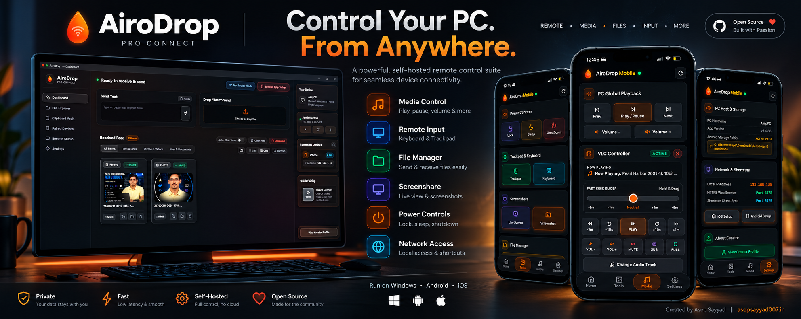

# AiroDrop v6.4.70



> **AiroDrop** is a lightweight, self-hosted local network companion app designed to bring seamless AirDrop-like cross-device file sharing, Universal Clipboard synchronization, remote PC control, and desktop screencasting to iOS, Android, and Windows — with zero cloud dependency and complete privacy.

---

Official Website **[AiroDrop Hub](https://airodrop.site/)** | Developer **[Asep Sayyad](https://asepsayyad007.in/)**


---

## Downloads (v6.4.70)

Get the latest pre-compiled binaries for Windows:
* **[Download Setup Installer (v6.4.70)](https://github.com/asepsayyad007/AiroDrop/releases/download/v6.4.70/AiroDrop.Setup.6.4.70.exe)** — Standard Windows wizard installation.
* **[Download Portable Version (v6.4.70)](https://github.com/asepsayyad007/AiroDrop/releases/download/v6.4.70/AiroDrop-Portable-6.4.70.exe)** — Standalone execution without installation.

For a detailed history of changes, see the [CHANGELOG.md](CHANGELOG.md).

---

## How It Works

AiroDrop operates as a high-performance local HTTP/WebSocket gateway on your Windows PC. Mobile devices connect over your local Wi-Fi subnet without third-party cloud servers or user registration.

```
┌─────────────────────────┐               Local Wi-Fi Subnet               ┌─────────────────────────┐
│     iOS / Android       │ ─────────────────────────────────────────────── │       Windows PC        │
│  (Safari PWA / Chrome)  │  ◄───────────── WebSocket / HTTP ─────────────► │   (AiroDrop Core Server) │
└─────────────────────────┘                                                └─────────────────────────┘
            │                                                                           │
   ┌────────┴────────┐                                                         ┌────────┴────────┐
   │ iOS Shortcuts   │ ────────────── POST http://<PC-IP>:3479/api/send ──────► │ Windows Clipboard│
   │  & Share Sheet  │                                                         │    (Ctrl + V)   │
   └─────────────────┘                                                         └─────────────────┘
```

1. **Instant Pairing**: Scan the dynamic QR code on the PC dashboard or navigate to `https://<PC-IP>:3478/m` on your mobile device.
2. **Seamless Transfer**: Copy text, photos, or files on mobile and send via 1-Tap iOS Share Sheet or PWA portal. Text immediately lands on your PC clipboard (`Ctrl+V`).
3. **Local Shared Storage**: Transferred files automatically land in your designated PC downloads folder with full HTTP File Manager access at `http://<PC-IP>:3478/files`.
4. **Low-Latency Streaming**: Real-time WebSocket connections stream desktop displays (~15fps) and input control events (touchpad, keyboard, system power commands).

---

## Core Capabilities

### Universal Clipboard & Instant Transfer
* **Bi-Directional Auto Sync:** Automatically syncs copied text and images between mobile devices and Windows clipboard (`Ctrl+V`) instantly.
* **Smart URL Extraction:** Automatically extracts clean web links shared from Safari, Chrome, or social apps.
* **Interactive Clipboard Inspector:** Fullscreen text view and editor modal with instant `Copied!` visual feedback.

### Mobile File Manager & Browser
* **Access Shared Directory in Mobile PWA App:** Access, browse, upload (up to 4 GB per file), download, rename, delete, and create folders directly inside your PC's shared storage directory straight from the mobile PWA app (`/files`).
* **High-Speed Transfers:** Direct local network streaming with real-time transfer progress, speed metrics (`MB/s`), and iOS QuickLook compatibility.

### Mouse Pad & Remote Keyboard
* **Interactive Touchpad Mouse Pad:** Full multi-touch gesture support — smooth cursor navigation, tap-to-click, double-click, right-click, and 2-finger scroll directly on your phone screen.
* **Real-Time Keyboard Typing Sync:** Virtual keyboard typing sync to type text directly onto your Windows PC in real time.

### Remote PC Control & Live Screencast
* **Live PC Desktop Screencast:** Stream your PC monitor to mobile devices at ~15fps with pinch-to-zoom (up to 5×) and touch panning.
* **VLC Media Player Remote:** Full control over VLC media playback (play/pause, seek, volume, subtitles, audio tracks) with automatic active title detection.
* **System Power Utilities:** Remote Lock, Sleep, and Power Off controls directly from your mobile device.

### Security & Privacy Architecture
* **100% Local Subnet Privacy:** Zero cloud routing, zero data retention, and zero external tracking.
* **Granular Security Controls:** Security Modes, optional Access PIN lock, and iOS Secret Access Key verification (`X-AiroDrop-Token`).
* **Standalone Port Allocation:** Dual-port architecture separating HTTPS web portal (`3478`) and HTTP iOS Shortcut API (`3479`) for zero-friction setup.

---

## Prerequisites

* Both your PC and mobile device must be connected to the same local network subnet (Wi-Fi).
* **Node.js v18.0.0** or higher installed on your PC.

---

## Installation & Setup (Developer Mode)

To run or modify the app locally:

1. **Clone this repository:**
   ```bash
   git clone https://github.com/asepsayyad007/AiroDrop.git
   cd AiroDrop
   ```
2. **Install dependencies:**
   ```bash
   npm install
   ```
3. **Run in Development Mode:**
   ```bash
   npm start
   ```

*To package the application into standalone installers (`.exe` or portable), run `npm run build`.*

---

## iOS Shortcuts & REST API Configuration

Easily share content directly from any iOS App Share Sheet or Home Screen widget, or integrate via REST API.

> **Authentication & Secret Key:**
> If Security Mode is enabled or an **iOS Shortcut Secret** is configured on PC, pass your secret in every HTTP request as a header: `X-AiroDrop-Token: <your_secret>` or append `?token=<your_secret>` to the URL. Use port `3479` (HTTP fallback port) for iOS Shortcuts to bypass self-signed SSL warnings.

### Shortcut Installation Links
* **1. Share to PC (Share Sheet):** [Get Share to PC Shortcut](https://www.icloud.com/shortcuts/bd3ef813f57d435e8e7d3d1823b13ad8)
* **2. Send Clipboard (Widget):** [Get Clipboard Shortcut](https://www.icloud.com/shortcuts/3e39fa6cad3147019dc905e96994b1e6)
* **3. Get From PC (Receive Files):** [Get From PC Shortcut](https://www.icloud.com/shortcuts/1698d917c5a3447abea2fa506d7b1dac)

### REST API Endpoints
* **`POST /api/send`**: Send form text (`content=hello`) or raw binary file body. Header: `X-AiroDrop-Token`.
* **`GET /api/clipboard`**: Fetch current active text or pending transfer item. Header: `X-AiroDrop-Token`.
* **`POST /api/pending/:id/ack`**: Acknowledge receipt of a queued transfer item. Header: `X-AiroDrop-Token`.

---

## Configuration (`config.json`)

Settings are stored in `<App Data Directory>/AiroDrop/config.json`. Key configuration parameters:

* `port`: Server listening port (default: `3478`).
* `deviceName`: The hostname shown to mobile clients.
* `rateLimitEnabled`: Enable connection rate limiting (default: `true`).
* `notificationsEnabled`: Trigger Windows desktop alerts for incoming transfers (default: `true`).
* `temporaryMode`: Discard session files automatically after client disconnects (default: `false`).
* `saveDir`: Target download path for transferred items.
* `shareDir`: Root shared path exposed to the HTTP File Browser.

---

## Credits & Authors

AiroDrop is created and maintained by **[Asep Sayyad](https://asepsayyad007.in/)**. You can explore the project details and links on the **[AiroDrop Hub](https://airodrop.site/)**.

---

## License

This project is proprietary and confidential. All rights reserved.
